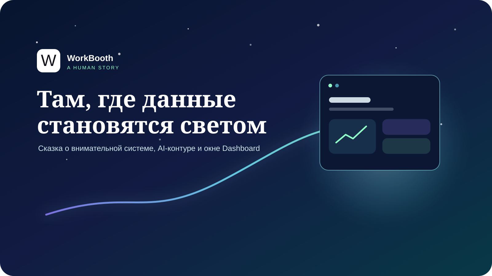

<p align="center">
  
</p>

# c_history

Небольшая публичная сказка о WorkBooth, внимательном AI-контуре и Dashboard.
Она показывает идею и ценности проекта, не раскрывая внутреннюю архитектуру,
инфраструктуру, конфигурации, данные или рабочие процессы.

**[Открыть живую историю на GitHub Pages](https://ms8at.github.io/c_history/)**

## О чём история

Разрозненные сигналы находят общий язык. AI-помощники помогают замечать связи
и перепроверять путь, но не забирают у человека решение. Dashboard становится
спокойным окном, через которое видно главное.

Все сцены на странице — художественные метафоры. Это не техническая схема, не
операционная документация и не заявление о конкретном развёртывании.

## Посмотреть локально

Страница не требует сборки и внешних зависимостей. Откройте `index.html` либо
запустите локальный статический сервер:

```powershell
py -3 -m http.server 8080
```

После этого откройте `http://localhost:8080/`.

## Проверить

```powershell
npm test
```

Тест проверяет состав публичного пакета, локальные ссылки, базовую доступность,
отсутствие внешних ресурсов и чувствительных внутренних маркеров.

## Состав

- `index.html` — сама история;
- `styles.css` — адаптивная визуальная система;
- `script.js` — локальные декоративные эффекты и прогресс чтения;
- `assets/cover.svg` — оригинальная обложка;
- `assets/workbooth-mark.png` — знак WorkBooth из текущего фирменного компонента;
- `docs/` — Target, план, дорожная карта, чек-лист и план тестирования;
- `tests/validate-project.mjs` — автономная проверка публичного пакета.

## Приватность и права

Проект не использует аналитику, трекеры, внешние шрифты, API или сетевые
запросы. Права на материалы описаны в [LICENSE.md](LICENSE.md).
